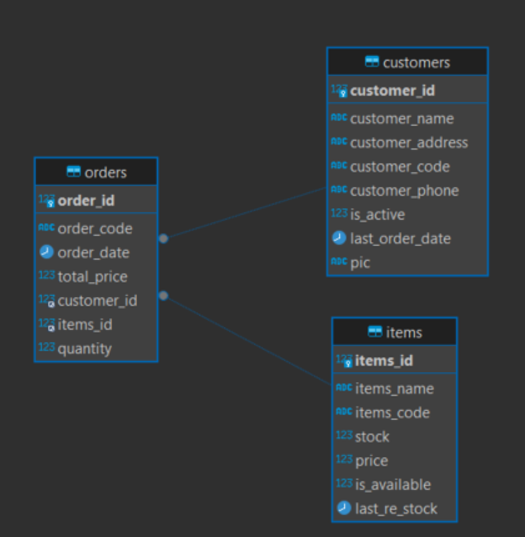
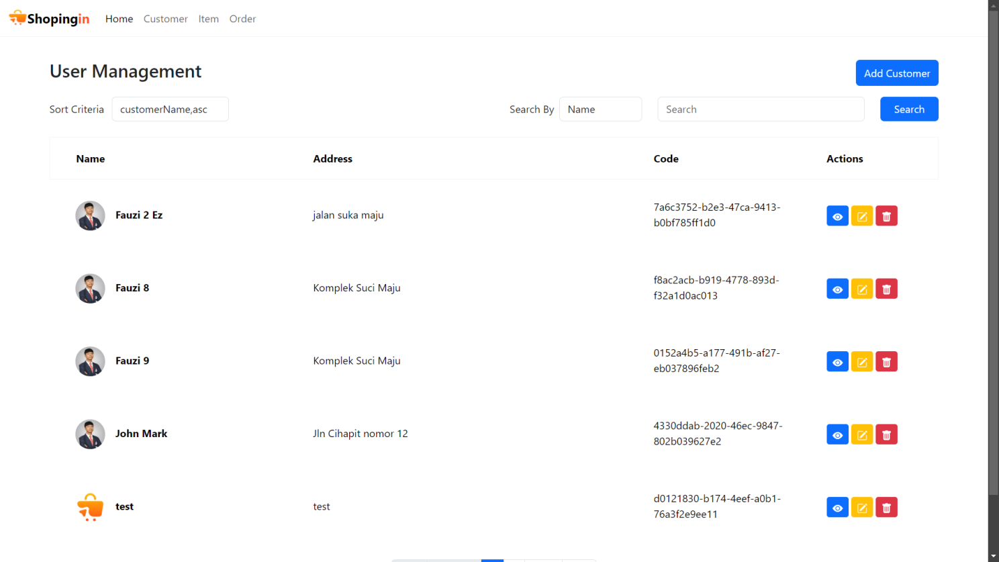
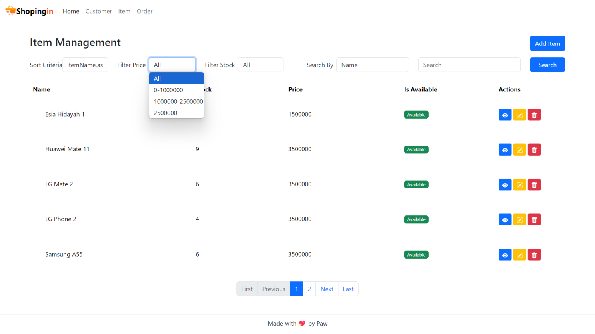
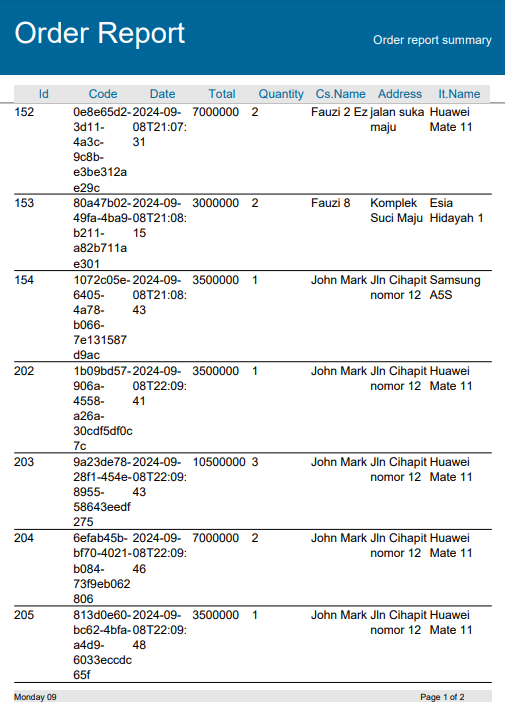

# Simple Online Shop with Spring Boot, Angular, and Jasper Report

🚀 Find a more detailed explanation about the concept and code in my [LinkedIn Article](https://www.linkedin.com/pulse/create-simple-online-shop-spring-boot-angular-jasper-rizki-hamdalah-a7fbc/?trackingId=xne9id7VQIeru1i6dTfcuw%3D%3D).\
⭐ Give a star if you think this repository is awesome

## 🤔 About
This repository show you how to create a straightforward online shop application using Spring Boot for the backend, Angular for the frontend and Jasper Report for generating report. With just these technologies, you'll set up a simple yet functional online shop. 
\
\
Quick look at what this application can do: manage customer, item, and order data with ease, and generate detailed order summary reports.

## 🏁 Getting Started

### Requirements
This application is built using technologies such as spring boot, angular, and jasper report. To create this project, the following prerequisites need to be met:
- Java 17 or higher
- NodeJs 20 or higher with NPM package manager
- Angular CLI, you can install by executing the command below (make sure you have node js and npm)
- MySQL Database
- MinIO (For object storage, you can also use your file storage to save customer image profile)
- Jasper Studio
- IDE/Text Editor (I'm using IntelliJ Idea Community Edition for developing backend and Visual Studio Code for developing frontend)

### Setup Database
Create new database called "onlineshop", then create tables customer, item and order like design below. 
\
You can create the database and tables by executing this SQL query i've provided that can be accessed in this [Link](https://github.com/mfauzirh/online-shop-springboot-angular/blob/main/be-online-shop/database.sql).


### Setup MinIO
Because it's to long to cover in this readme, you can read the step-by-step to setup MinIO in my [LinkedIn Article](https://www.linkedin.com/pulse/create-simple-online-shop-spring-boot-angular-jasper-rizki-hamdalah-a7fbc/?trackingId=xne9id7VQIeru1i6dTfcuw%3D%3D). 🙇

### Setup Jasper Report
Because it's to long to cover in this readme, you can read the step-by-step to setup Jasper Report in my [LinkedIn Article](https://www.linkedin.com/pulse/create-simple-online-shop-spring-boot-angular-jasper-rizki-hamdalah-a7fbc/?trackingId=xne9id7VQIeru1i6dTfcuw%3D%3D). 🙇‍♂️

### Run the Spring Boot Backend
To run the Spring Boot application, use this command.
```
mvn spring-boot:run
```

### Run the Angular Frontend
To run the Angular application, use this command.
```
ng serve
```

## 😎 Result
- User Management\

- Item Management Filter\

- Order Report PDF\
